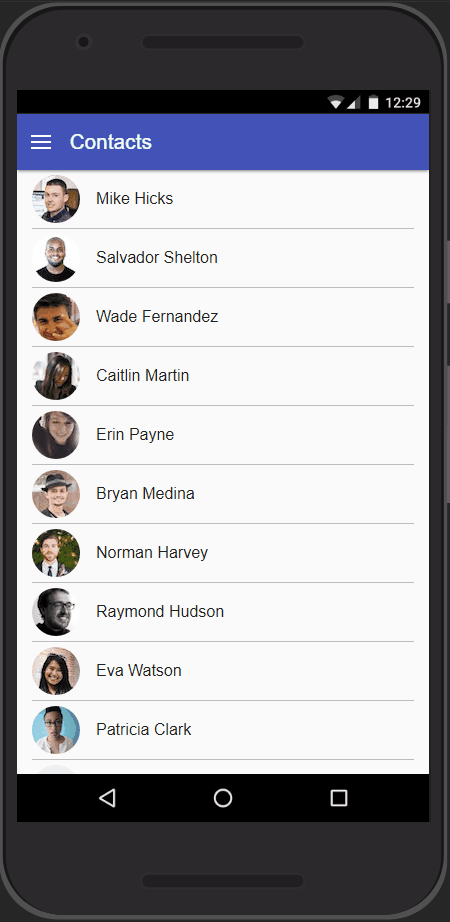

# Demo of the Intersection Observer API

A demo of a contacts view that lazy-loads the contact's images when they are in the viewport.

Best viewed by throttling your connection using the chrome dev tools.

## What is the Intersection Observer?

> The Intersection Observer API provides a way to asynchronously observe changes in the intersection of a target element with an ancestor element or with a top-level document's viewport.

Using the Intersection Observer, we are able to run a callback function whenever a target element intersected the viewport or a specified element.

## Browser Support

See [caniuse.com](https://caniuse.com/#feat=intersectionobserver)

## Further info

[Intersection Observer MDN](https://developer.mozilla.org/en-US/docs/Web/API/Intersection_Observer_API)
